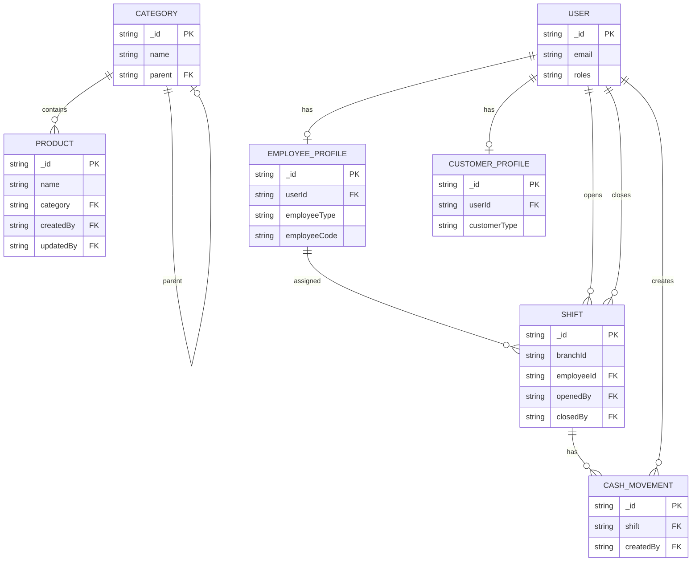

# ER Diagram

This diagram reflects the current MongoDB models across services (IAM, Product Catalog, Shift).

Notes:
- `EMPLOYEE_PROFILE.userId` and `CUSTOMER_PROFILE.userId` reference `USER._id`.
- `SHIFT.employeeId` is populated from the IAM JWT `employeeId` field.
- `CATEGORY.parent` is a self-reference for nested categories.
